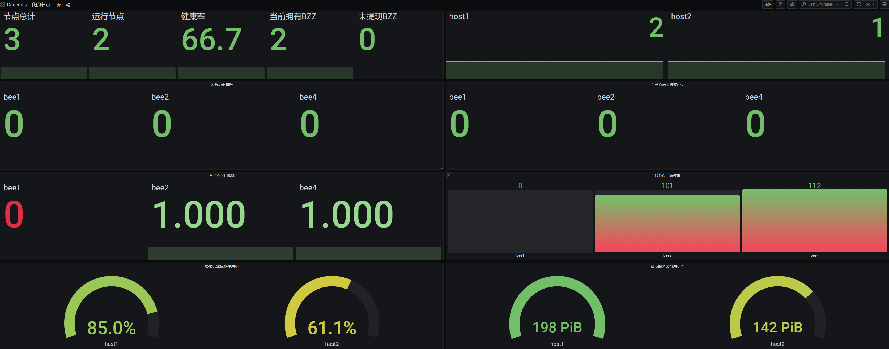

<br><br><br>
### 请保证每个节点的名称是唯一的! 本方案兼容一机多节点及Docker<br>
### 目前仅支持Linux系统<br>
### 有问题欢迎到 Discord https://discord.gg/PJwJzCkT4W 咨询

### 安装监控服务，仅需在主服务器上安装

#### 安装Docker及Docker Compose (已安装的可跳过)
请确保3000和9090端口没被占用且可被外部访问

这里仅给出Ubuntu安装命令，其他系统可自行搜索安装教程
```
sudo apt-get update
sudo apt install docker.io
sudo systemctl start docker
sudo curl -L "https://github.com/docker/compose/releases/download/1.29.2/docker-compose-$(uname -s)-$(uname -m)" -o /usr/local/bin/docker-compose
sudo chmod +x /usr/local/bin/docker-compose
sudo ln -s /usr/local/bin/docker-compose /usr/bin/docker-compose
```

#### 下载安装集群监控服务端
1.执行以下命令
```
wget https://github.com/ytx1991/SwarmMonitoring/raw/main/server/install_server.sh
chmod +x install_server.sh
./install_server.sh
```

2.修改/root/swarmon/prometheus/prometheus.yml文件。

可使用sudo vim /root/swarmon/prometheus/prometheus.yml编辑

根据自己拥有的服务器数量和IP修改对应内容，端口号不要改变，默认示例包含四个服务器Host1 - Host4，可删掉多余的服务器
```
static_configs:
      - targets: ['YOUR_HOST_IP1:3903']
        labels:
          host: host1
      - targets: ['YOUR_HOST_IP2:3903']
        labels:
          host: host2
      - targets: ['YOUR_HOST_IP3:3903']
        labels:
          host: host3
      - targets: ['YOUR_HOST_IP4:3903']
        labels:
          host: host4
```
3.修改完成保存后运行下面命令启动服务端
cd ~/swarmon && sudo docker-compose up -d

此时你应该可以通过浏览器访问主服务器3000端口， 如192.168.1.2:3000 并看到Grafana登录界面。

使用用户名：admin 密码：swarmadmin 登录管理员账号，登录后可修改管理员密码。

监控面版及数据源应该已经预设好，直接打开便可使用。

### 下载安装集群监控客户端 （每个有节点的服务器都需要安装）

请确保3903端口没被占用且可被外部访问

1.运行以下命令下载安装监控客户端
```
wget https://github.com/ytx1991/SwarmMonitoring/raw/main/client/install_client.sh
chmod +x install_client.sh
./install_client.sh
```

2.编辑run_datacollector.sh,添加当前服务器上的节点。
可使用 vim ~/swarmon_client/run_datacollector.sh 编辑

```
修改下面两行，第一行为节点的debug api，用空格隔开
第二行为节点名称，需要确保节点名称是唯一的，不同服务器上不能有相同名称的节点

nodes=(127.0.0.1:1635 127.0.0.1:1735)
names=(bee1 bee2)
```
修改完成后保存退出

3.运行以下命令：
cd ~/swarmon_client && ./run_datacollector.sh

如需停止可运行：
cd ~/swarmon_client && ./stop_datacollector.sh


